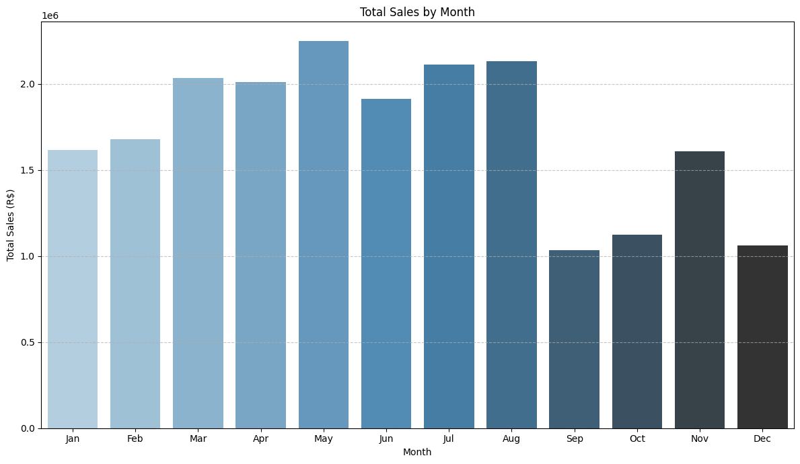
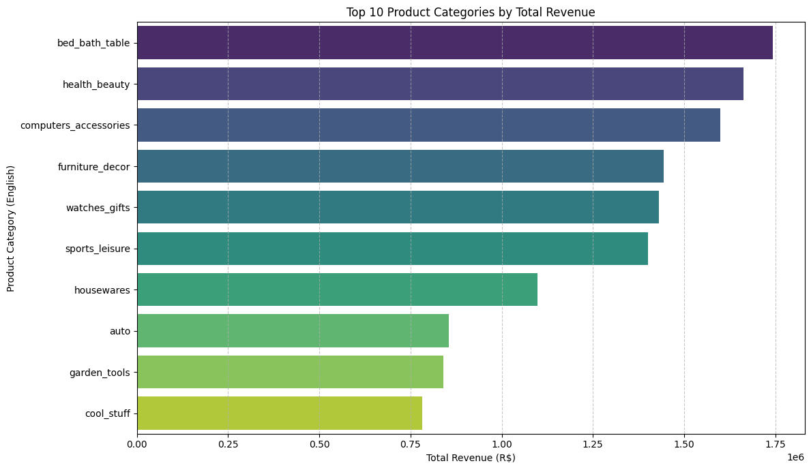
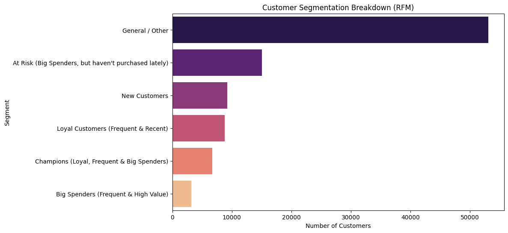

# Olist Brazilian E-Commerce: Growth Analytics & Customer Segmentation

## Summary
This project delivers a data-driven analysis of Olist's Brazilian e-commerce operations, focusing on transforming raw transactional data into actionable business strategies. By engineering an end-to-end data pipeline in Python, this analysis uncovers critical growth engines, exposes logistical bottlenecks in Brazil's urban landscape, and builds an advanced **RFM (Recency, Frequency, Monetary) Customer Segmentation** model to optimize marketing spend and improve retention.

---

## Business Insights & Visualizations

### 1. The Seasonal Revenue Peak
Our temporal analysis revealed an explosive, single-month revenue surge in **November**, which might be driven heavily by Black Friday. 
* **Business Takeaway:** While highly profitable, this massive seasonal spike puts immense pressure on operations. Logistics scaling and supply chain readiness must be triggered by October to avoid backlogs.

### 2. The Geographic Market Concentration
Revenue and unique customer counts are heavily concentrated in major urban hubs, with **Sao Paulo** dominating the chart.
* **Business Takeaway:** While urban concentration lowers marketing acquisition costs, it leaves a massive untapped market in outer states. 

### 3. Advanced RFM Customer Segmentation
By analyzing customer purchasing behavior, we categorized the user base into distinct behavioral segments (e.g., *Champions*, *Can't Lose Them*, *New Customers*). This addresses Olist's core challenge: **a high volume of one-time buyers and low repeat-order rates.**

---

## Recommendations
1. **Targeted Retention Campaigns:** Pivot marketing budget away from expensive customer acquisition and toward automated email marketing/loyalty programs tailored specifically for the *Can't Lose Them* (high-spenders who haven't bought recently) and *Champions* segments.
2. **Logistics Optimization:** Since buyers are concentrated in São Paulo but average delivery times remain high (~12+ days), Olist should establish localized fulfillment centers closer to top-tier seller clusters to aggressively slash delivery durations.
